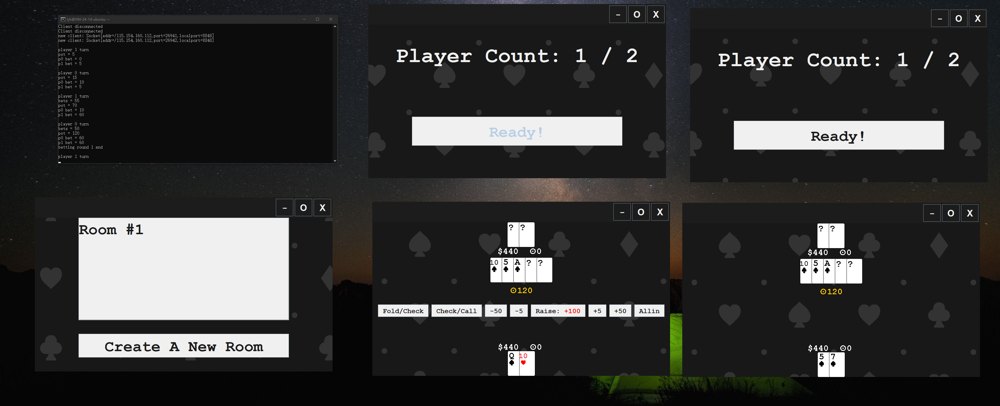

## 在线德州扑克游戏
### 分组
刘一可、许孜诚
### 分工
- 服务端：Server.java（刘一可）
- 客户端：Client.java（刘一可），UserInterface.java（许孜诚），Data.java（共同）

实际开发中也有交叉，可以通过`git log`查看提交记录。
### 个人信息
姓名：刘一可
班级：计试2201
学号：2203714888
### 项目介绍
基于java的在线德州扑克游戏。该游戏服务器已部署在 [43.143.223.49:8848](43.143.223.49:8848) ，用户运行Client.Client即可开始游戏。
进入游戏大厅后，点击 `Start!` 按钮查看房间列表。玩家可以双击进入一个房间，或创建新房间。
进入房间后，可以看到房间中的玩家数与已准备玩家数，点击 `Ready` 按钮准备。当所有玩家都已准备时开始游戏。
游戏过程中，玩家可以进行 Fold,Check,Raise,All in 等操作，具体规则见 [Texas Hold'em](https://en.wikipedia.org/wiki/Texas_hold_%27em#) 。
游戏一直进行到仅剩一名玩家拥有筹码且在线，游戏结束后玩家会返回大厅。
该项目的 git 仓库位于： [git@43.143.223.49:/home/git/texas](git@43.143.223.49:/home/git/texas) 。
### 实现过程
服务端维护用户列表、房间列表、游戏列表，以及每局游戏中的牌、筹码等。
服务端维护玩家信息，并在游戏中将必要信息发送到客户端。
服务端计算与比较玩家手牌大小。
客户端与用户交互。
#### 服务端实现
##### Server.java
- Server 类
  储存全局信息。
  - accepter 线程
    监听新连接的客户端，将其套接字存入集合。
  - handler 线程
    与大厅中的用户通信，检测其在线状态，并处理加入/创建房间请求。
- Room 类
  用于实现同时启动多个游戏，有多批玩家时，每批玩家可以加入一个房间。
  - handler 线程
    与房间中的用户通信，检测其在线状态与准备状态，在满足一定条件时开始游戏（有多于一个人并且全部准备时）。
- Game 类
  - 构造函数
    初始化玩家金额、位置等信息。
  - game 线程
    只要有多于一个在线且未破产玩家，就开始一局“游戏”。
  - “游戏”
    洗牌、发牌、进行四轮下注。
    中途若其他人都fold，直接结束。
    最后计算所有人手牌价值，判定胜者。
  - “下注”
    依次询问每个活跃玩家，处理其动作。
- Card 类、CardGroup5 类、CardGroup7 类
  牌与牌组，用于判定手牌价值。具体算法较繁琐。
- User 类
  储存客户端套接字，用户状态（大厅/房间/准备/游戏等）。
  封装了几个常用的交互方法，避免直接使用 `writeInt()` 等。
- Player 类
  含有一个 User 对象，并添加了游戏中的数据(手牌、筹码、状态等)。
  封装了发送手牌、接收行为、下注等常用方法。
#### 客户端实现
##### Client.java
- 负责与服务器通信，将服务器发来的状态信息处理后存入 Data.java。
  封装了`webReadInt(),webReadCard(),webReadBetAndPot(),recvStatus(),recvRoomList()`, `webSendInt(),sendStatus(),sendOption()` 等方法。
- 负责与UI通信，将UI通过管道发来的用户操作处理后发往服务器。
  封装了`userReadInt(),tryUserReadInt()`等方法。
##### Data.java
  储存了状态信息，UserInterface 读取这些信息以显示给玩家。
  由 Client 根据 Server 发来的信息更新。
##### UserInterface.java
  根据 `data.status` 显示不同的用户界面，以按钮的形式向用户提供接口，将用户行为翻译后通过管道传给 Client。
### 结果展示
下图包含：服务器、五个客户端（两个在房间中，两个在游戏中，一个在大厅）

当前目录下还有一个[展示视频](结果展示.mp4)。
